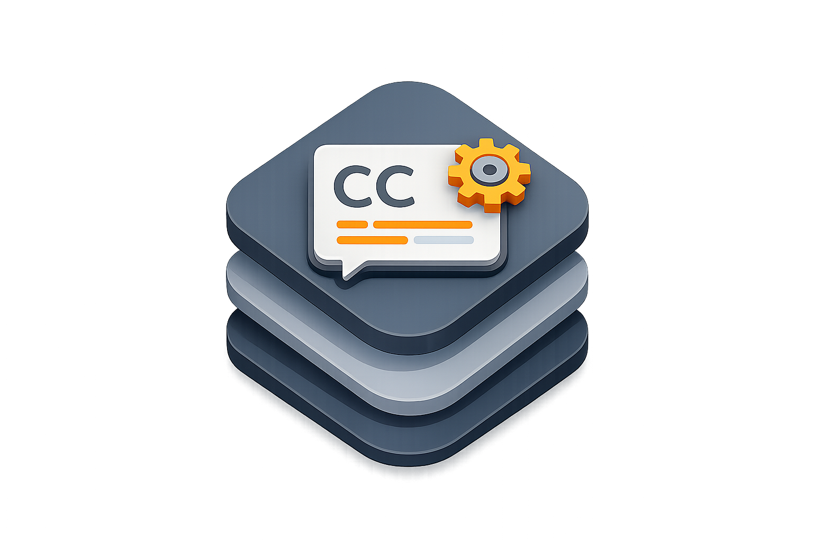

# OnDeviceCaptionKit

<p align="center">
  
</p>

[](https://swift.org)

[](https://github.com/dadederk/OnDeviceCaptionKit/actions/workflows/ondevicecaptionkit-tests.yml)
[](LICENSE)

On-device caption transcription, SRT export, and CEA-608 MOV closed-caption embedding for Swift apps on macOS.

OnDeviceCaptionKit provides:
- On-device speech transcription through Apple's Speech framework.
- Modern `SpeechAnalyzer` transcription with legacy `SFSpeechRecognizer` fallback.
- SRT sidecar generation with deterministic timestamp and text wrapping behavior.
- CEA-608 closed-caption embedding for `.mov` files using AVFoundation.
- Typed errors and stable warning codes for host-app localization.

v1 scope is caption generation and export only. UI, localization copy, save panels, settings, logging policy, microphone capture, screen recording, and user-facing fallback messaging stay in the consuming app.

## Requirements

| Item | Requirement |
| --- | --- |
| Swift tools | 6.2+ |
| macOS | 26+ |
| Dependencies | None |

## Installation

Add OnDeviceCaptionKit to your `Package.swift` dependencies:

```swift
dependencies: [
    .package(url: "https://github.com/dadederk/OnDeviceCaptionKit.git", from: "0.1.0")
]
```

Then add the product to your target:

```swift
target(
    name: "YourApp",
    dependencies: [
        .product(name: "OnDeviceCaptionKit", package: "OnDeviceCaptionKit")
    ]
)
```

## Quick Start

OnDeviceCaptionKit is built around three common tasks: transcribe audio, write SRT, and embed captions into a MOV.

Transcribe audio on device:

```swift
import Foundation
import OnDeviceCaptionKit

let pipeline = CaptionPipeline(
    configuration: .init(
        transcription: CaptionTranscriptionConfiguration(
            locale: Locale(identifier: "en-US")
        )
    )
)

let result = try await pipeline.transcribe(from: audioURL)
let segments = result.segments
```

Write an SRT file:

```swift
try pipeline.writeSRT(segments: segments, besideVideoAt: savedVideoURL)
```

Embed closed captions in a MOV:

```swift
let export = try await pipeline.exportCaptions(
    segments: segments,
    videoURL: videoURL,
    format: .embeddedMovCaptions
)

let captionedVideoURL = export.videoURL
```

Asset consent example:

```swift
let locale = Locale(identifier: "en-US")

if let requirement = await CaptionPipelineCapabilities.requiresAssetDownload(for: locale) {
    // Show host-app UI explaining Apple's speech model download.
    // Continue only after explicit user consent.
    try await CaptionPipeline.prepareAssets(for: requirement.locale, consentGranted: true)
}
```

## API Overview

- `CaptionPipeline`: transcribe, export, and write-SRT orchestration.
- `CaptionPipeline.Configuration`: host-app configuration for transcription, authorization, and prepared speech assets.
- `CaptionSegment`: timed caption text with start/end times.
- `CaptionTranscriptionConfiguration`: locale, asset policy, transcript debug logging, and provider preference.
- `CaptionTranscriptionResult`: transcript segments plus the provider that produced them.
- `CaptionOutputFormat`: `.embeddedMovCaptions` or `.srtSidecar`.
- `CaptionExportResult`: exported video URL, source segments, deferred SRT segments, and warning code.
- `CaptionError`: stable error cases and `code` strings for host-app localization.
- `CaptionPipelineCapabilities`: provider, locale, and asset-download capability helpers.
- `SpeechAuthorizationProviding`: injectable speech authorization boundary for apps and tests.

## Privacy and Network

- User audio is transcribed on device.
- The package requests Speech authorization only when transcription starts.
- Network access is limited to Apple speech model downloads, and only after the host app passes explicit consent to `prepareAssets`.
- Production logs contain counts and error codes only. Transcript text is logged only when a caller opts into debug transcript logging in debug builds.

## Caption Export Behavior

- Embedded `.mov` captions use CEA-608 closed captions.
- Empty or whitespace-only caption text is skipped.
- Long caption text is split into row-sized CEA-608 events so AVFoundation does not silently truncate it.
- If MOV embedding fails after transcription succeeds, `CaptionExportResult` preserves the original video URL and returns deferred SRT segments so the host app can offer a fallback file.
- SRT output is UTF-8, uses `HH:MM:SS,mmm` timestamps, and avoids an extra trailing blank separator.

## Apps Using OnDeviceCaptionKit

- [Mestre!](https://accessibilityupto11.com/apps/mestre/) - macOS screen recorder with optional embedded captions and SRT export.
- Let us know if you'd like your app to be listed here.

## Xcode Integration

1. In Xcode, open your project and select `File > Add Package Dependencies...`
2. Enter `https://github.com/dadederk/OnDeviceCaptionKit.git`.
3. Choose a version rule and add the `OnDeviceCaptionKit` library product to your target.

## Troubleshooting

- Speech authorization fails: request authorization from a user-visible flow and localize `CaptionError.code` values in the host app.
- A locale is unavailable: use `CaptionPipelineCapabilities.supportedTranscriptionLocales()` and let the user choose a supported locale.
- Asset download requires consent: call `requiresAssetDownload(for:)`, explain the Apple speech asset download, then call `prepareAssets(for:consentGranted:)` after consent.
- MOV embedding fails: preserve the original video and use `deferredSRTSegments` to write an SRT fallback.
- Import problems in Xcode: confirm your target links the `OnDeviceCaptionKit` product and uses a compatible macOS deployment target.

## Development

Run tests from the repository root:

```bash
swift test
```

Deterministic tests use local AVFoundation fixtures and stubbed muxers. CI tests must not depend on a real microphone, screen capture, network, or live Speech recognition.

## Changelog

See [CHANGELOG.md](CHANGELOG.md) for release history and breaking-change notes.

## Contributing

See [CONTRIBUTING.md](CONTRIBUTING.md) for local setup and PR guidelines.

## License

MIT. See [LICENSE](LICENSE).
